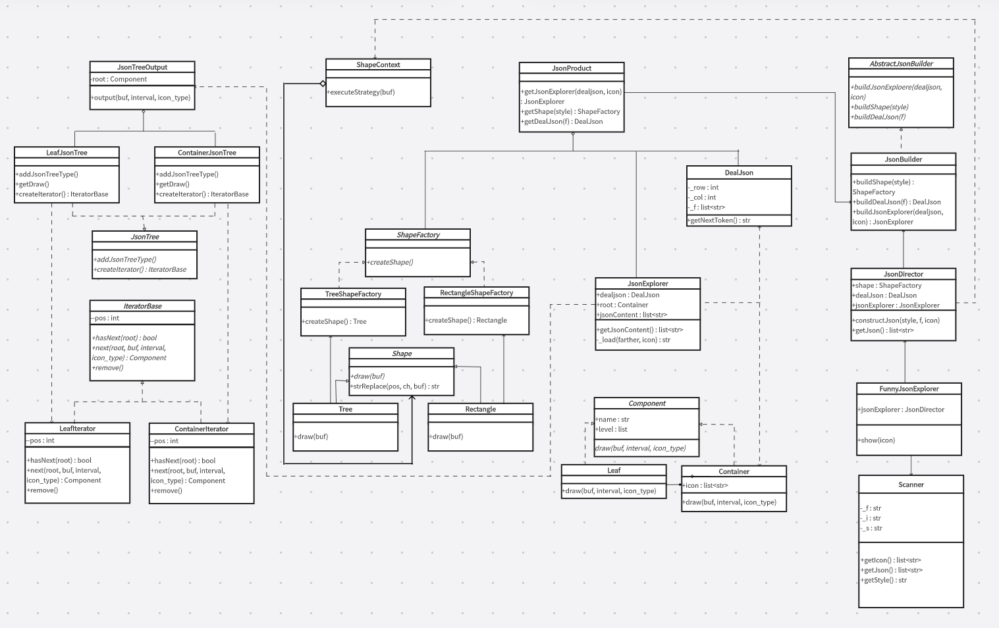
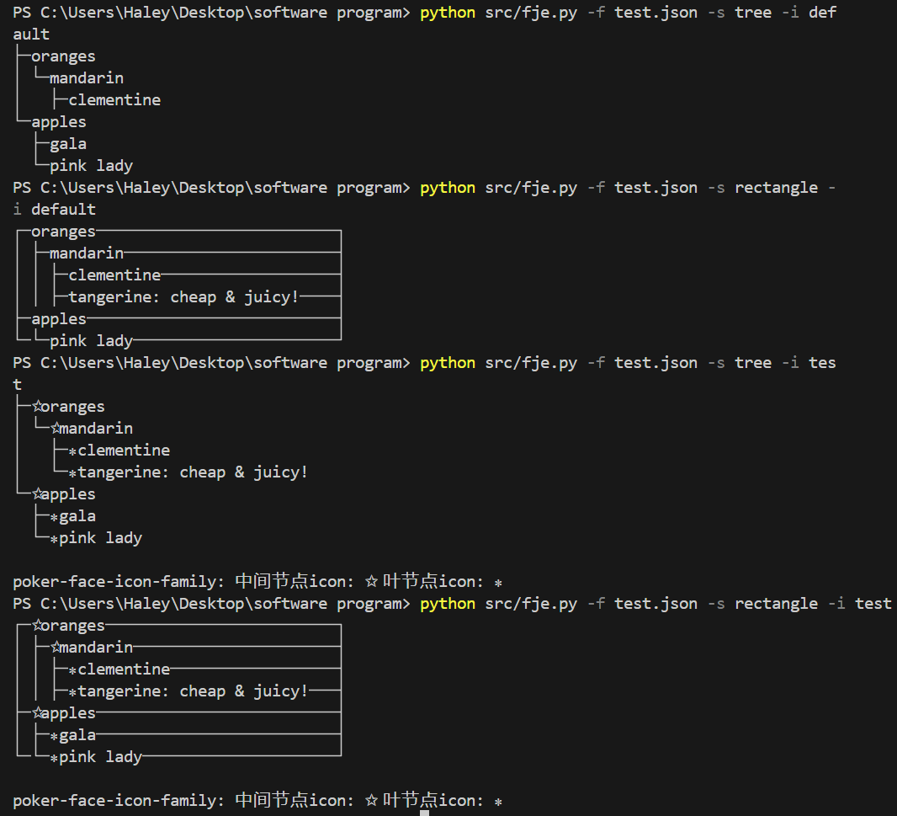

# Funny JSON Explorer

## 1. 设计文档

### 类图

### 说明

- JsonTreeOutput，LeafJsonTree，ContainerJsonTree，JsonTree，IteratorBase，LeafIterator，ContainerIterator够成迭代器模式。其中IteratorBase作为迭代器，LeafIterator，ContainerIterator作为具体的迭代器，JsonTree作为元素集，LeafJsonTree，ContainerJsonTree作为具体的元素集，JsonTreeOutput作为客户端来使用。

- ShapeContext，Shape，Tree，Rectangle作为策略模式。其中，ShapeContext作为环境校色，Shape作为抽象策略角色，Tree，Rectangle作为具体策略角色。

- Component作为组合模式的Component组件，Leaf作为组合模式的Leaf组件，Container作为组合模式的Composite组件。实现对于树状结构的Json文件的读写。
- JsonDirector，JsonBuilder，AbstractJsonBuilder和JsonProduct够成建造者模式。其中，AbstractJsonBuilder作为builder组件，JsonBuilder作为ConcreteBuilder组件，JsonDirector作为Director组件，JsonProduct作为Product组件。实现对于Json文件输出，存储，到格式转换整个过程的封装。
- Shape，ShapeFactory，Component是抽象工厂。Shape对于Json文件输出格式进行指定，ShapeFactory则是对于指定何种Shape的封装，Component则是对于Json每个节点的存储的指定。
- 在工厂方法中，Shape是抽象产品接口，TreeShapeFactory，RectangleShapeFactory是具体工厂类，ShapeFactory是抽象工厂接口，Tree和Rectangle是具体产品类，JsonProduct作为客户端来调用。对Json文件的输出格式的转换过程进行了封装，并且客户端可以简单轻便调用。实现不改变现有代码，就可以添加新的风格。例如添加新的风格Custon，只需加入新的CustonShapeFactory实现ShapeFactory和Custon实现Shape即可。
- 另外，上述文件对于icon的表示，是读取存储在[`configs/icon.yaml`](configs/icon.yaml)，因此只需修改这个配置文件，就可以添加新的图标族

## 2. 运行截图

## 3. Github repo URL

[fje](https://github.com/banianrong/fje-iterator) : `https://github.com/banianrong/fje-iterator`